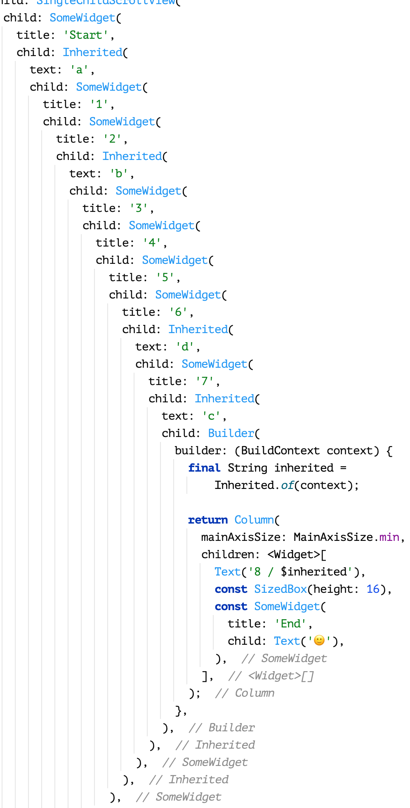
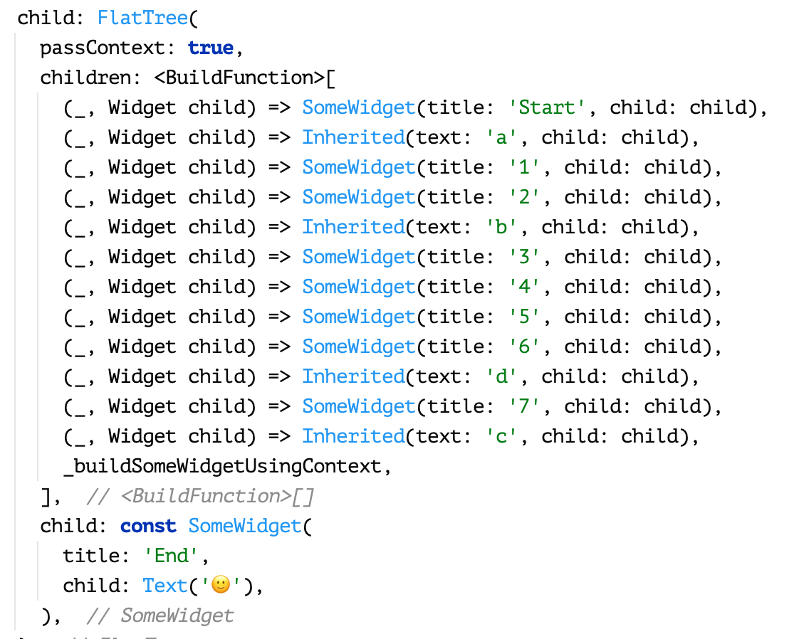
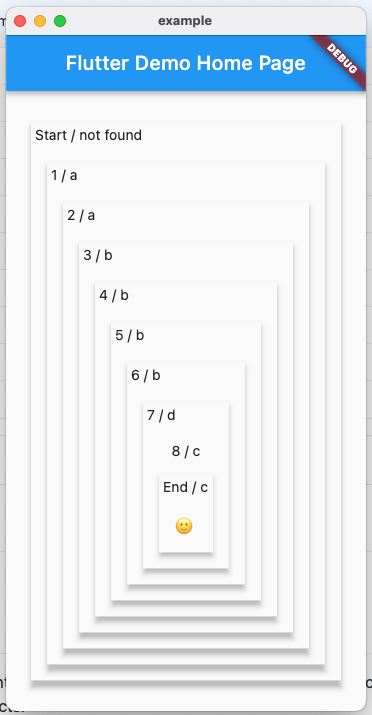

# flat_tree

Flat widget tree

## Purpose

Usually Flutter widgets tree code looks somewhere like this:

A number of indents and a long list of closing "),),),"

My main purpose was to decrease code size and add code readability.
This package can do it in some cases. Take a look:

Tree hierarchy was reduced to simple list.

## Example

Please check example and learn how to use widget:

